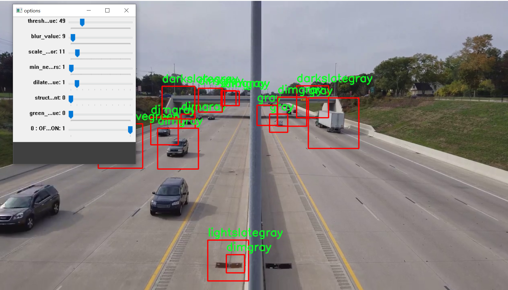

# Python Car Detector

Simple car detector built using OpenCV

## Features:

* Controllable green color for fooliage and grass removal
* Car color names
* Car motion detection
* Threshold, Dilation and other values control on the fly

## Project Structure

* Option Class for sliders and controllabe values
* Detector class for car detection

## Requirements

* OpenCV 2
* Numpy

